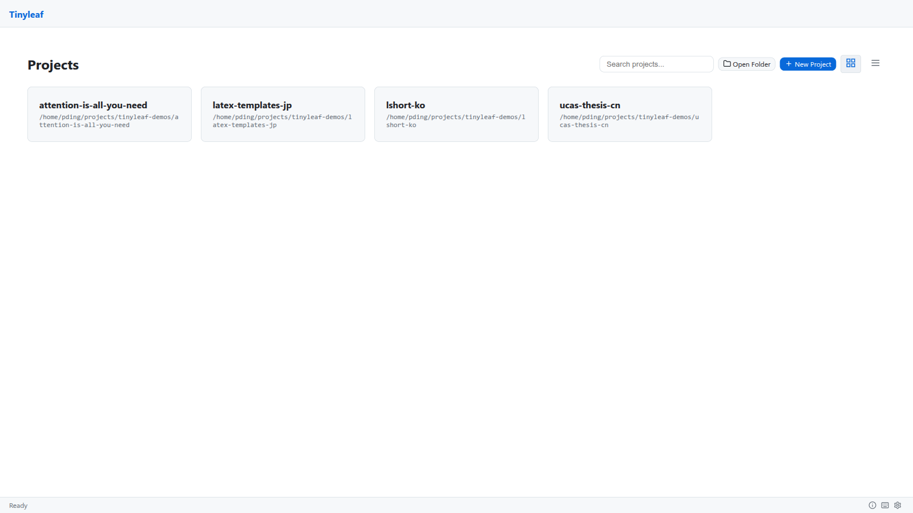

# Quick Start

## Single Project Mode

Open a LaTeX project directory directly:

```bash
tinyleaf /path/to/my-thesis
```

This starts the editor on `http://localhost:8080` and opens it in your browser. Docker compilation is enabled by default.

### Disable Docker (Local Compilation)

```bash
tinyleaf /path/to/my-thesis --no-docker
```

### Custom Port and Host

```bash
tinyleaf /path/to/my-thesis --port 3000 --host 0.0.0.0
```

### Custom Docker Image

```bash
tinyleaf /path/to/my-thesis --image oaklight/texlive:alpine-science
```

## Multi-Project Mode

Launch without arguments to enter registry mode:

```bash
tinyleaf
```

From the project page you can:

- **Open Folder** — browse the filesystem and register an existing directory
- **New Project** — create a new LaTeX project at a chosen path
- **Rename** — change a project's display name
- **Remove** — unregister a project (optionally delete files from disk)
- **Search** — filter projects by name or path
- **View toggle** — switch between grid and list views



Projects are stored in `~/.config/tinyleaf/projects.json`.

## Keyboard Shortcuts

| Shortcut | Action |
|----------|--------|
| `Ctrl+S` | Save current file |
| `Ctrl+Enter` | Compile |
| `Ctrl+Shift+E` | Switch to Files tab |
| `Ctrl+Shift+G` | Switch to Git tab |
| `Ctrl+Shift+Alt+C` | Git commit |
| `Ctrl+Shift+Alt+P` | Git push |
| `Ctrl+/` | Show keyboard shortcuts |
| `Esc` | Close dialog |

!!! tip
    Press `Ctrl+/` at any time to see the full shortcuts panel.
