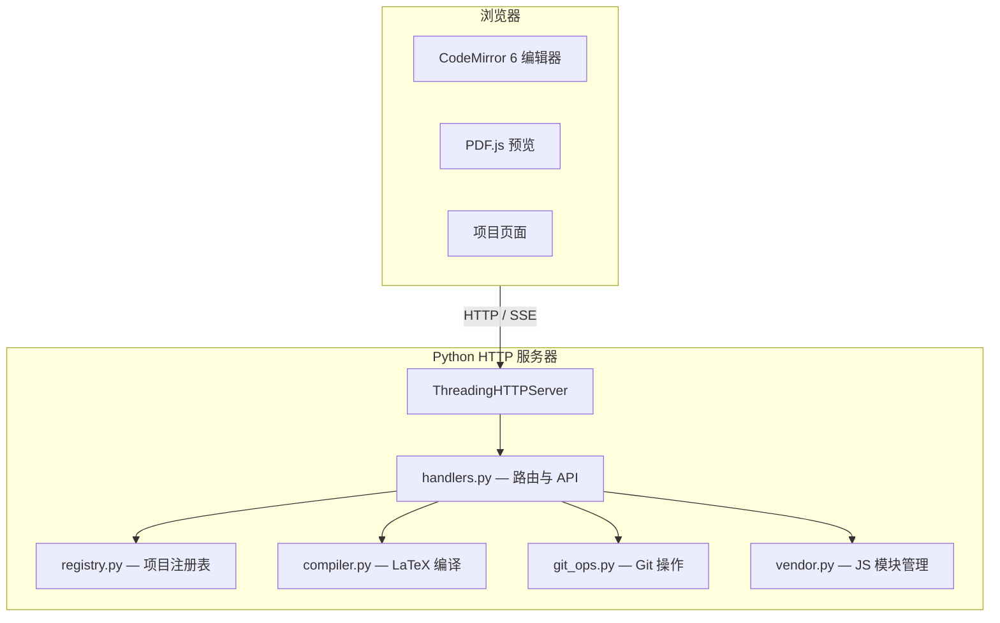

# 架构概览

Tinyleaf 是一个完全基于 Python 标准库构建的 Web 应用。

## 组件结构

## 模块概览

| 模块 | 职责 |
|------|------|
| `cli.py` | CLI 参数解析、服务器启动 |
| `server.py` | HTTP 路由、静态文件服务、SSE 支持 |
| `handlers.py` | API 请求分发、文件操作、项目管理 |
| `registry.py` | 线程安全的项目注册表 CRUD（`projects.json`）|
| `compiler.py` | LaTeX 编译任务（本地或 Docker）|
| `git_ops.py` | Git status、diff、commit、push、pull、log |
| `vendor.py` | 下载和管理本地 JS 模块（CodeMirror、PDF.js）|

## 关键设计决策

- **零依赖** — 后端仅使用 Python 标准库
- **单 HTML 文件** — 整个前端（HTML + CSS + JS）由一个 `index.html` 提供
- **SSE 编译流** — 通过 Server-Sent Events 实时推送编译日志
- **注册表模式** — 项目通过名称到路径的映射存储在 JSON 文件中，而非目录列举
- **线程安全** — 使用 `threading.Lock` + 原子 `os.replace` 确保并发安全
- **本地 JS 模块** — CodeMirror 6 和 PDF.js 在首次启动时下载到本地，CDN 作为回退
