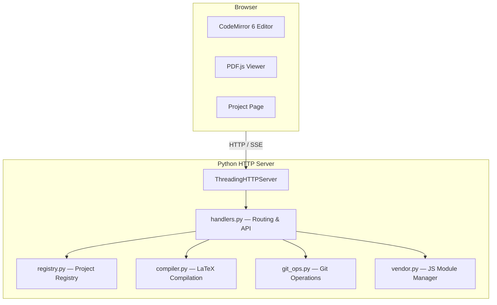

# Architecture

Tinyleaf is a single-binary web application built entirely with Python's standard library.

## Components

## Module Overview

| Module | Responsibility |
|--------|---------------|
| `cli.py` | CLI argument parsing, server startup |
| `server.py` | HTTP routing, static file serving, SSE support |
| `handlers.py` | API request dispatch, file operations, project management |
| `registry.py` | Thread-safe project registry CRUD (`projects.json`) |
| `compiler.py` | LaTeX compilation jobs (local or Docker) |
| `git_ops.py` | Git status, diff, commit, push, pull, log |
| `vendor.py` | Download and manage vendor JS modules (CodeMirror, PDF.js) |

## Key Design Decisions

- **Zero dependencies** — only Python stdlib on the backend
- **Minimal frontend** — HTML markup, CSS, and JS are split into `index.html`, `css/app.css`, and `js/app.js` with no build step
- **SSE for compilation** — real-time log streaming via Server-Sent Events
- **Registry pattern** — projects are tracked by name-to-path mapping in a JSON file, not by directory listing
- **Thread safety** — `threading.Lock` + atomic `os.replace` for concurrent registry access
- **Vendor JS modules** — CodeMirror 6 and PDF.js are downloaded locally on first start, with CDN fallback
