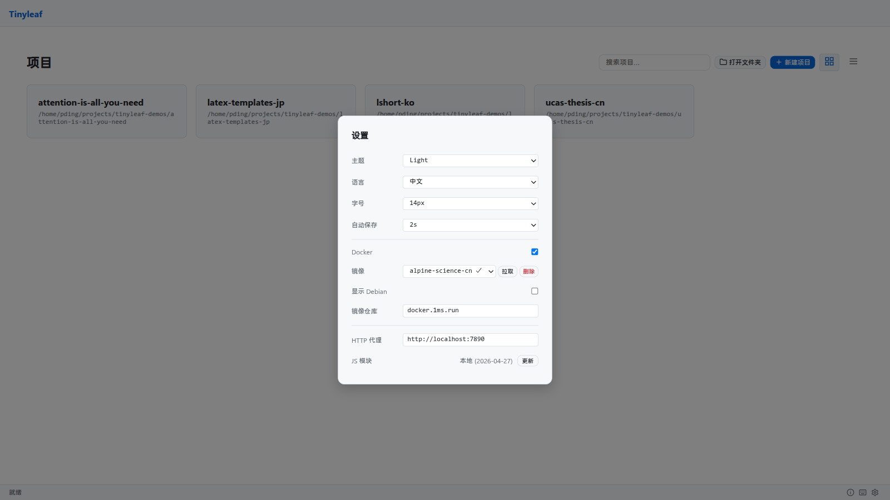

# Docker

Tinyleaf can be deployed as a Docker container or use Docker for LaTeX compilation (default).

## Docker for Compilation (Default)

Docker compilation is enabled by default. Tinyleaf uses Docker containers with full TeX Live installations:

```bash
# Uses Docker by default
tinyleaf /path/to/project

# Specify a different image
tinyleaf /path/to/project --image oaklight/texlive:alpine-science
```

### Available Images

The [oaklight/texlive](https://github.com/Oaklight/texlive) images provide various TeX Live configurations:

| Image | Description |
|-------|-------------|
| `oaklight/texlive:alpine-science-cn` | Science packages + Chinese fonts (default) |
| `oaklight/texlive:alpine-science` | Science packages |
| `oaklight/texlive:alpine-science-jp` | Science packages + Japanese fonts |
| `oaklight/texlive:alpine-science-kr` | Science packages + Korean fonts |
| `oaklight/texlive:debian-science-cn` | Debian-based, Science + Chinese fonts |
| `oaklight/texlive:debian-science` | Debian-based, Science packages |

### Image Management

From the settings panel you can:

- **Pull** new images from Docker Hub
- **Delete** unused local images
- Configure a **registry mirror** for faster downloads in restricted networks
- Toggle **Show Debian** to include Debian-based image variants



### Auto-Pull

If the configured Docker image is not available locally, tinyleaf automatically pulls it on the first compilation attempt.

### Font Cache

For faster subsequent compilations, Docker volume caching is recommended for font directories:

- `/root/.texlive2023/texmf-var`
- `/var/lib/texmf/luatex-cache`

## Docker Compose Deployment

Run the editor itself inside a container:

```bash
docker compose up
```

This starts the web editor on `http://localhost:8080` with a persistent TeX Live container for compilation.

## Disabling Docker

To use local `latexmk` instead of Docker:

```bash
tinyleaf /path/to/project --no-docker
```
