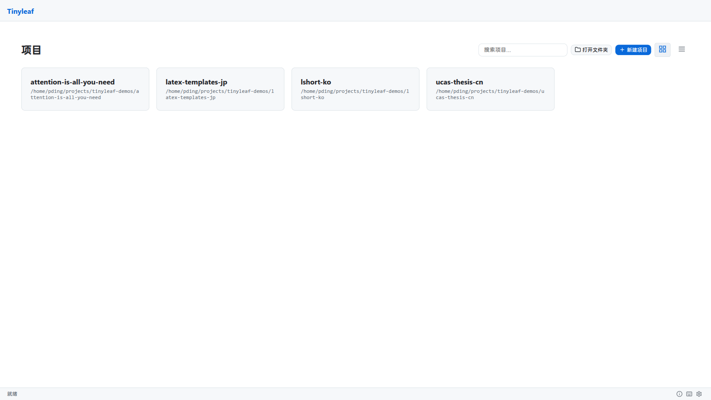

# 多项目注册表

不带 `project_path` 参数启动时，tinyleaf 进入**多项目模式**，由项目注册表驱动。

## 工作原理

项目信息存储在 `~/.config/tinyleaf/projects.json` 中：

```json
{
  "my-thesis": {
    "path": "/home/user/documents/thesis",
    "added_at": "2025-01-15T10:30:00"
  },
  "paper-2025": {
    "path": "/home/user/research/paper",
    "added_at": "2025-02-20T14:00:00"
  }
}
```

每个条目将项目名称映射到一个**绝对文件系统路径**。项目可以位于任何位置——不需要在同一个父目录下。

## 管理项目

### 通过 UI

- **打开文件夹** — 浏览服务器文件系统，注册已有目录
- **新建项目** — 指定名称和父路径，创建包含默认 `main.tex` 的新项目
- **重命名** — 修改项目显示名称
- **移除** — 取消注册项目，可选择同时从磁盘删除文件
- **搜索** — 通过搜索框按名称或路径过滤项目

### 视图模式

项目列表支持两种视图模式，通过工具栏按钮切换：

- **网格视图** — 卡片布局，显示项目名称、路径和 Git 标识
- **列表视图** — 紧凑的单列布局，显示时间戳

视图偏好保存在 `localStorage` 中。



### CLI 选项

```bash
# 注册表模式（不带路径参数时的默认行为）
tinyleaf

# 自定义配置目录
tinyleaf --config-dir /path/to/config

# 旧版迁移：自动注册所有子目录
tinyleaf --projects-dir /path/to/old/projects
```

## Git 标识

Git 仓库项目会在项目名称旁显示 Git 标识，提供版本控制状态的快速可视化指示。

## 失效项目

如果已注册项目的目录在磁盘上不存在，项目卡片将以虚线边框和"(missing)"标签显示。你可以在项目页面移除失效条目。

## 线程安全

注册表使用 `threading.Lock` 和原子写入（`os.replace`）来确保线程 HTTP 服务器并发访问时的一致性。
