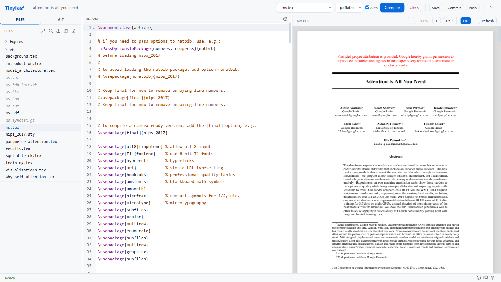

---
hide:
  - navigation
---

# Tinyleaf


**轻量级、零依赖的 Web LaTeX 编辑器。**

Tinyleaf 是一个 CLI 优先的 LaTeX 编辑器，运行在浏览器中。后端仅依赖 Python 标准库，支持本地和 Docker 两种编译方式。



## 特性

- **零依赖** — 仅使用标准库（`http.server` + `threading` + `subprocess`）
- **两种模式** — 单项目或基于注册表的多项目模式
- **两种编译后端** — 本地 `latexmk` 或 Docker 容器（默认）
- **CodeMirror 6** 编辑器 + 多语言语法高亮
- **PDF.js** 预览，支持缩放、高清渲染、文字搜索和页码导航
- **LaTeX 自动补全** — `\ref{}`、`\cite{}`、`\label{}` 符号扫描补全
- **Git 集成** — 状态、差异、提交、推送、拉取
- **多标签编辑器**，快速打开（`Ctrl+P`）和 `\begin`/`\end` 自动配对
- **7 套主题**，支持明暗切换（翡翠绿主色调）
- **国际化** — 中英双语
- **键盘快捷键** — 完整的快捷键帮助面板（`Ctrl+/`）

## 快速开始

```bash
pip install tinyleaf

# 单项目模式（默认启用 Docker 编译）
tinyleaf /path/to/my-thesis

# 多项目模式（注册表模式）
tinyleaf

# 本地编译（不使用 Docker）
tinyleaf /path/to/my-thesis --no-docker
```

查看[更多截图](screenshots.md)了解完整界面。

## 链接

- [GitHub 仓库](https://github.com/Oaklight/tinyleaf)
- [PyPI 包](https://pypi.org/project/tinyleaf/)
