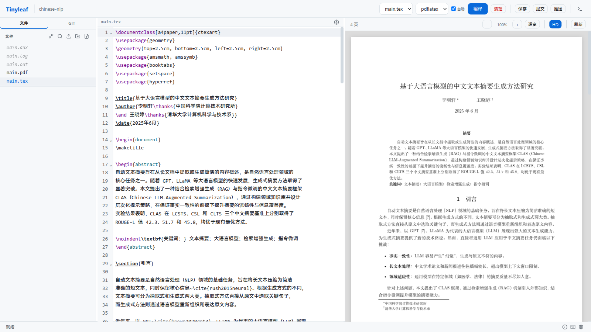
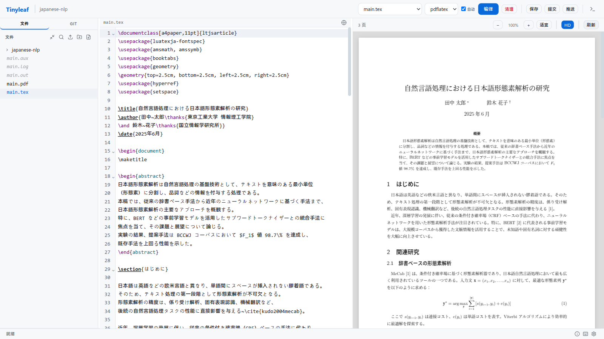
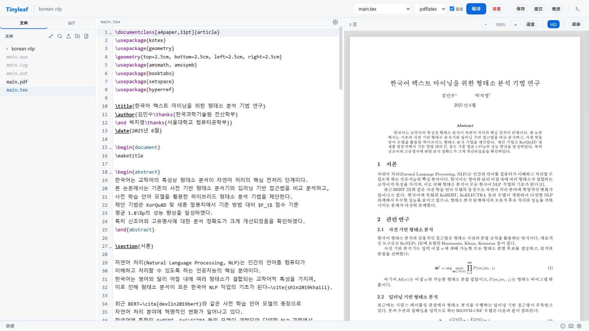
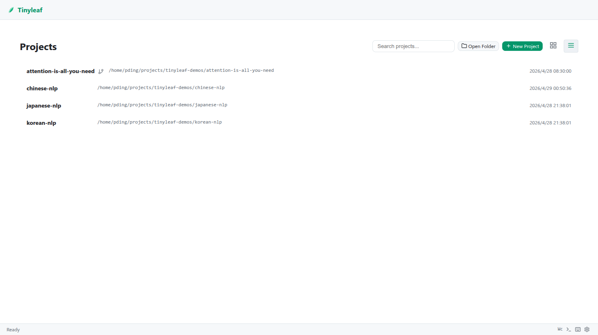
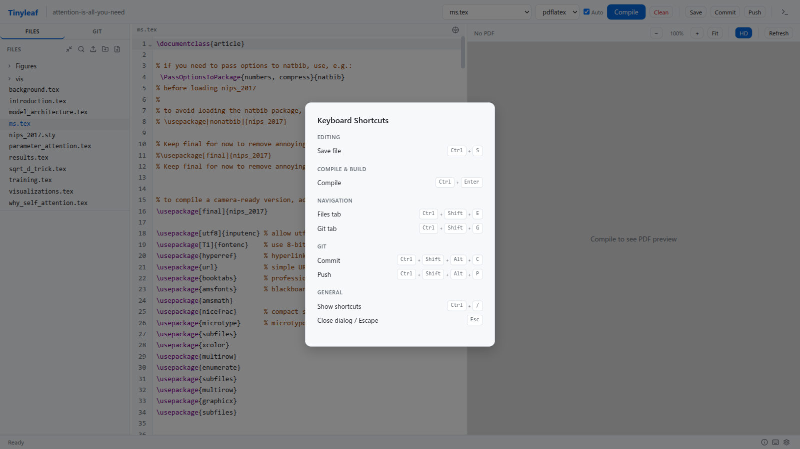
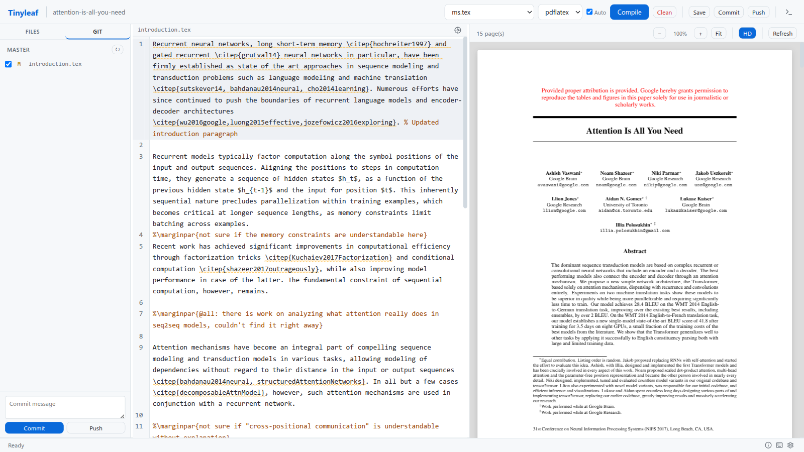
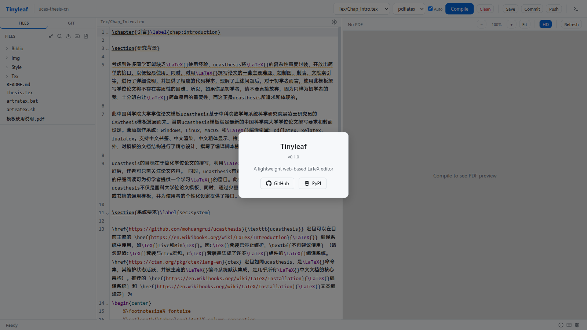

---
hide:
  - navigation
---

# Screenshots

## Editor with PDF Preview

The main editing interface: LaTeX source on the left, live PDF preview on the right.

## Editor with CJK Content

Full CJK support — editing a Chinese NLP paper with ctex macros and lualatex.

Editing a Japanese NLP paper with luatexja and lualatex.

Editing a Korean NLP paper with kotex and xelatex.

## Project List — Grid View

Multi-project mode displays registered projects as cards. Search, open folder, and create new projects from the toolbar.

## Project List — List View

Compact list layout with timestamps, toggled via the toolbar.

## Settings Panel

Configure theme, language, font size, auto-save interval, Docker image, and registry mirror.

## Keyboard Shortcuts

All keyboard shortcuts at a glance — press `Ctrl+/` to open.

## Git Integration

The Git panel shows changed files with commit and push controls.

## About

Version info and quick links to GitHub and PyPI.

